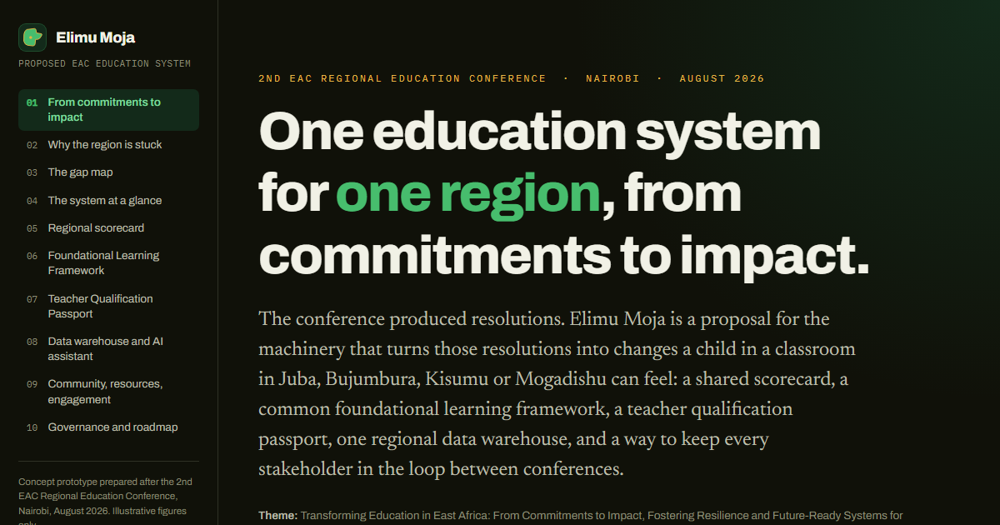

<a href="https://atindahhillary.github.io/Elimu-Moja/">
  
</a>

<p align="center"><strong><a href="https://atindahhillary.github.io/Elimu-Moja/">Open the live site &rarr; atindahhillary.github.io/Elimu-Moja</a></strong></p>

# SELution

**Learning through play, made regional.**

SELution is a play-based programme that delivers four connected strands through one teacher-training
pathway and one measurement spine:

1. **Social and emotional learning (SEL)**
2. **Foundational literacy and numeracy (FLN)**
3. **Unplugged coding**
4. **Robotics**

Play is the method that runs through all four, not a fifth strand.

It is built on the priorities set at the **2nd EAC Regional Education Conference** (Nairobi, August
2026), which put FLN, SEL and parental engagement at the centre of the regional agenda and named play
as the pedagogy that delivers them. SELution is a way to carry that consensus into classrooms.

> SELution is an independent regional initiative. It is not an EAC programme or publication. Partner
> names and country references on the site describe early-stage conversations, not confirmed
> commitments.

---

## The programme in one table

| Strand | What it is | The play mechanic |
|---|---|---|
| **SEL** | Naming feelings, turn-taking, calming routines, friendship and conflict repair. | A circle game with a scenario, roles for every child, one agreed class rule. |
| **Foundational literacy and numeracy** | Letter sounds, decoding, number sense, early operations, mapped to the national curriculum. | Timed team games with bottle-cap tiles; the score is the assessment. |
| **Unplugged coding** | Sequencing, loops, debugging, algorithms, with no device. | Arrow-card programs on a floor grid; the class debugs the wrong turns together. |
| **Robotics** | The same computational thinking with a physical build. | Low-cost and recycled parts; one kit shared across a cluster on a rota. |

Every session runs the same cycle: **goal, game, roles, reflect, record**. The 10-second record per
child is the raw material for measurement.

---

## A pilot

One district cluster (8 to 15 schools), one to two terms, run by an implementing partner inside the
existing school system. Baseline and endline assessment, per-child records rolling up to a cluster
dashboard, and a joint decision on scale against a pre-agreed evidence threshold. Materials are
deliberately cheap; spend concentrates on teacher coaching.

Full detail: the [concept note](concept-note.html) and the [site](index.html).

---

## Repository contents

| Path | What it is |
|---|---|
| [`index.html`](index.html) | The SELution site: the offer, the four strands, EAC alignment, the pilot model, and the asks by audience. |
| [`concept-note.html`](concept-note.html) | One-page concept note, printable / save-as-PDF, for emailing to partners, ministries and funders. |
| [`prototypes/`](prototypes/) | Working browser prototypes. `unplugged-coding.html` (a programmable floor grid) and `readiness-map.html` (a weighted regional baseline tool) run today; the rest are stubbed. |
| [`regional-brief.html`](regional-brief.html) | The **regional systems brief** SELution builds on: the earlier concept for a unified EAC education system (scorecard, framework, teacher passport, data warehouse, gap map). Kept as the reference and credibility layer. |
| [`assets/proto.css`](assets/proto.css), [`assets/proto.js`](assets/proto.js) | Shared design system and runtime for the site and prototypes. No build step, no dependencies. |
| [`docs/`](docs/) | Conference summary, gap register, and three advisory research briefs from the regional-brief phase. |

---

## View it

- **Live:** <https://atindahhillary.github.io/Elimu-Moja/>
- **Local:**

```bash
python -m http.server 8000
# then open http://localhost:8000
```

GitHub Pages: Settings &rarr; Pages &rarr; Source: **Deploy from a branch** &rarr; **main** / **/(root)**.

---

## Status and caveats

- SELution is at **design and partnership stage**. The programme is defined; there is no funded pilot yet.
- All figures in the site and prototypes are **illustrative and synthetic**, included to show how the programme and its measurement would work.
- Strand content is drawn from public sources and playful-pedagogy practice and would need validation with each partner, curriculum institute and teacher service.

## Credits

Colours and the mark are drawn from the flags of the eight EAC partner states. Typefaces: Archivo,
Hanken Grotesk, IBM Plex Mono (Google Fonts).

## Licence

Content and documentation: [CC BY 4.0](LICENSE). Share and adapt with attribution.
